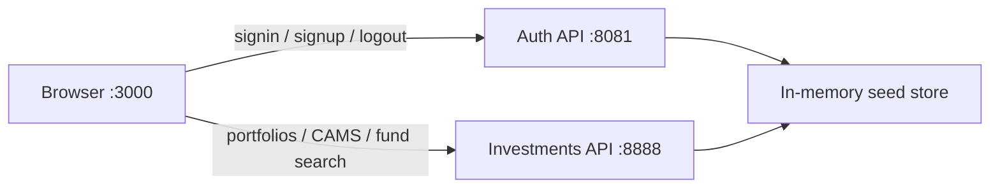

# MutualTrack

Prototype frontend for tracking **Indian mutual fund** investments: auth, portfolio dashboard, CAMS-style import, fund research, and scheme details.

> **Status:** This repo is a **precursor / UI prototype** of the real MutualTrack product (to be built later). Local development uses a **fake in-memory API** under [`mock-api/`](mock-api/) so screens and flows can be demoed without production backends.

**Live local URLs (default):**

| App | URL |
|-----|-----|
| Next.js UI | [http://localhost:3000](http://localhost:3000) |
| Auth API | [http://localhost:8081](http://localhost:8081) |
| Investments / funds API | [http://localhost:8888](http://localhost:8888) |

---

## What it does

MutualTrack lets a signed-in user:

1. **Create an account / sign in** — tokens and profile are stored in `localStorage`.
2. **View a portfolio dashboard** — invested value, current value, gain/loss, category pie chart, AMC bar chart, holdings table.
3. **Seed holdings** — empty portfolios can add rows manually or upload a CAMS-style report (mock parse appends sample funds).
4. **Research funds** — search the seeded catalog and open performance charts (1M → since inception).
5. **Open scheme details** — NAV, AUM, expense ratio, risk, returns, historical NAV.

The UI is a **Next.js App Router** client that talks to two Express listeners that share one in-memory store.



---

## Features (detail)

### Authentication & session
- Register (`/register`) and sign in (`/login`) against `POST /api/v1/auth/signup|signin`.
- Session: `access_token`, `refresh_token`, and `user_profile` in `localStorage` via [`AuthService`](app/util/ApiUtils.tsx).
- App-wide [`AuthProvider`](hooks/use-auth.tsx) hydrates session on load and syncs across tabs.
- [`RequireAuth`](app/components/require-auth.tsx) guards `/dashboard` and `/portfolio/...` (redirect → `/login`).
- [`GuestOnly`](app/components/guest-only.tsx) keeps signed-in users off `/login` and `/register` (redirect → `/dashboard`).
- Navbar shows **Sign In** / **Sign Out** and the user’s display name from session.

### Portfolio dashboard (`/dashboard`)
- Loads holdings with `GET /users/:userId/portfolios`.
- Summary cards: total invested, current value, gain/loss %.
- Charts (Recharts): category distribution (pie), AMC-wise value (bar).
- Sortable holdings table; scheme names link to `/portfolio/:schemeCode`.
- **Empty state:** add-investment form and CAMS upload modal.
- **Non-empty state:** charts/table + CAMS upload (add form currently only on empty state).

### CAMS upload & manual add
- Upload accepts PDF/CSV/Excel; mock API ignores file contents and appends a few seeded holdings.
- Manual add posts investment rows to `POST /users/:userId/investments` (matches scheme by name/AMC when possible).

### Research & fund pages
- `/search` — query param `?query=` → `GET /fund/search`.
- `/fund/[name]` — performance series for periods `1M`, `3M`, `1Y`, `3Y`, `5Y`, `SI`.
- `/portfolio/[schemeCode]` — scheme metrics from `GET /fund/:schemeCode/details`.

### Seeded catalog (mock API)
- **53** schemes across major Indian AMCs (HDFC, ICICI, SBI, Axis, Nippon, Mirae, PPFAS, UTI, Kotak, Quant, Motilal Oswal, DSP, …).
- Categories: **Equity**, **Debt**, **Hybrid**, **Index**.
- Deterministic NAV histories and period returns (in-memory; reset on API restart).

---

## Tech stack

| Layer | Choices |
|-------|---------|
| UI | Next.js **15** (App Router), React **19**, TypeScript |
| Styling | Tailwind CSS, shadcn/ui (Radix), Lucide icons |
| Forms / validation | React Hook Form, Zod, `@hookform/resolvers` |
| Data / charts | Axios, Recharts, TanStack Table |
| Auth UX | Client session + `RequireAuth` / `GuestOnly` |
| Fake backend | Express, CORS, Multer, UUID ([`mock-api/`](mock-api/)) |
| Tests | Vitest + Testing Library (app); `node --test` + SuperTest (API) |

---

## Prerequisites

- **Node.js 18+** (20+ recommended)
- **npm** 9+
- Ports **3000**, **8081**, and **8888** free locally

---

## Setup

```bash
git clone git@github.com:ashutoshpurushottam/mutual-tracker-app.git
cd mutual-tracker-app

# Frontend dependencies
npm install

# Fake backend dependencies (first time)
npm --prefix mock-api install
```

---

## Run locally

### Recommended: two terminals

```bash
# Terminal 1 — auth :8081 + investments :8888
npm run mock-api

# Terminal 2 — Next.js
npm run dev
```

Then open [http://localhost:3000](http://localhost:3000).

### One command (macOS / Linux)

```bash
npm run dev:all
```

This backgrounds the mock API, then starts Next.js. Stop with `Ctrl+C` (you may still need to stop the background API process separately if it keeps running).

### Health checks

```bash
curl -s http://localhost:8081/health
curl -s http://localhost:8888/health
```

Both should return JSON like `{ "ok": true, "service": "auth" }` / `"investments"`.

---

## Demo accounts

Use these after `npm run mock-api` is running:

| Email | Password | What you’ll see |
|-------|----------|-----------------|
| `demo@mutualtrack.com` | `password123` | ~11 holdings — full dashboard charts/table |
| `empty@mutualtrack.com` | `password123` | Empty portfolio — add form + CAMS upload |
| `active@mutualtrack.com` | `password123` | Smaller portfolio (~4 holdings) |

**Suggested walkthrough**

1. Sign in as `demo@mutualtrack.com` → open **Dashboard**.
2. Click a scheme name → portfolio detail + historical NAV.
3. Open **Research**, search `flexi` or `nifty` → open a fund → switch period tabs.
4. Sign out, sign in as `empty@mutualtrack.com` → add a holding or upload any dummy PDF as “CAMS”.

---

## App routes

| Route | Access | Purpose |
|-------|--------|---------|
| `/` | Public | Landing / hero |
| `/login` | Guests only | Sign in |
| `/register` | Guests only | Sign up |
| `/dashboard` | Auth required | Portfolio overview |
| `/portfolio/[schemeCode]` | Auth required | Scheme detail for a holding |
| `/search` | Public | Fund search (Research) |
| `/fund/[schemeId]` | Public | Fund performance charts |

---

## Project structure

```
mutual-tracker-app/
├── app/                      # Next.js App Router
│   ├── page.tsx              # Landing
│   ├── layout.tsx            # Root layout + AuthProvider + Toaster
│   ├── login/ · register/    # Auth screens
│   ├── dashboard/            # Portfolio dashboard + CAMS / add forms
│   ├── portfolio/[schemeCode]/
│   ├── fund/[name]/          # Performance charts
│   ├── search/               # Research UI
│   ├── components/           # Navbar, guards, portfolio widgets
│   ├── constants/            # API base URLs
│   └── util/                 # AuthService, investment API helpers
├── hooks/                    # useAuth, useToast
├── components/ui/            # shadcn primitives
├── mock-api/                 # Dual-port Express fake backend
│   ├── server.js             # Listens on 8081 + 8888
│   ├── store.js              # Users, tokens, portfolios
│   ├── data/                 # Schemes + demo users
│   ├── routes/               # auth, investments, funds
│   └── test/                 # API / store tests
├── vitest.config.ts
└── package.json
```

Full mock endpoint list: [`mock-api/README.md`](mock-api/README.md).

---

## Scripts

| Script | Description |
|--------|-------------|
| `npm run dev` | Next.js dev server on `:3000` |
| `npm run mock-api` | Fake API on `:8081` and `:8888` |
| `npm run dev:all` | Start mock API in background, then Next |
| `npm test` | App tests (Vitest) **then** mock-api tests |
| `npm run test:app` | Frontend only |
| `npm run test:api` | Mock API only |
| `npm run test:watch` | Vitest watch mode |
| `npm run build` | Production build |
| `npm run start` | Serve production build |
| `npm run lint` | ESLint |

---

## Tests

```bash
npm test
```

**App (Vitest + Testing Library)**  
- `AuthService` session store / logout events  
- Portfolio gain/loss helpers  
- `RequireAuth` / `GuestOnly` redirect behavior  

**Mock API (`node --test` + SuperTest)**  
- Sign-in / signup / invalid credentials  
- Portfolios, add investment, CAMS upload, delete  
- Fund search, performance, details  
- Scheme catalog size / search  

---

## Backend configuration

Defaults live in [`app/constants/index.tsx`](app/constants/index.tsx):

| Constant | Default |
|----------|---------|
| `API_BASE_URL` | `http://localhost:8081/api/v1/auth` |
| `INVESTMENTS_API_BASE_URL` | `http://localhost:8081/api/v1/` *(declared; many investment calls still use `:8888` directly)* |

Investment helpers in [`app/util/InvestmentUtil.tsx`](app/util/InvestmentUtil.tsx) call **`http://localhost:8888`** for portfolios, upload, and funds.

**Important:** the mock store is **in-memory**. Restarting `npm run mock-api` resets users created via signup and any CAMS/manual holdings added in that session (seeded demo users return to their initial portfolios).

When a real backend exists, point these URLs at it (and align path shapes with the contracts above).

---

## Troubleshooting

### Dashboard / Research empty or “failed to fetch”
- Confirm mock API is running (`curl` health endpoints above).
- Sign in again so `userId` in `localStorage` matches a mock user (e.g. `user-demo-001`).

### `npm install` fails with `recharts` / React 19 peer conflict
- Prefer upgrading `recharts` to **≥ 2.15** (supports React 19 peers).
- Temporary workaround: `npm install --legacy-peer-deps`.

### Home page 404 / `EMFILE: too many open files`
macOS file-watcher limits can break Next’s route discovery:

```bash
ulimit -n 65536
rm -rf .next
WATCHPACK_POLLING=true npm run dev
```

### Port already in use
```bash
lsof -i:3000,8081,8888
# then kill the listed PIDs if safe
```

### Logout / Sign Out seems stuck
Local session is cleared even if the logout API call fails. Hard-refresh if the navbar still looks stale.

---

## Repository & branches

- Default branch: **`main`**
- Feature work is expected via pull requests (see open PRs for allocation targets, watchlist, etc.).

---

## License

Private prototype (`0.1.0`). Not an investment advisory product — demo data only.
